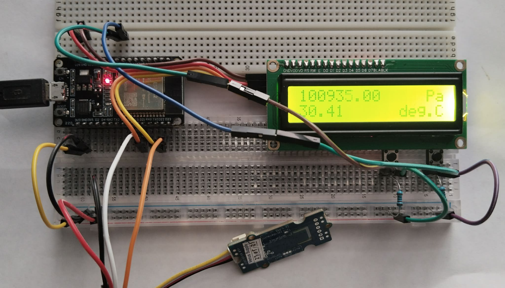
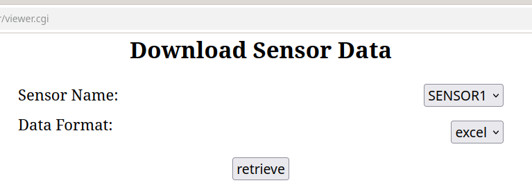
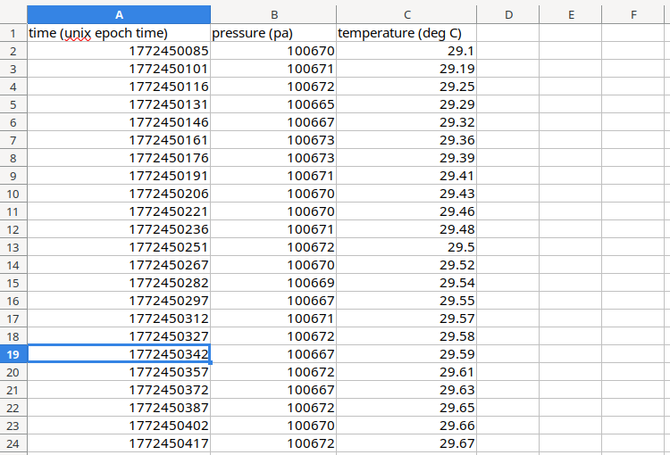
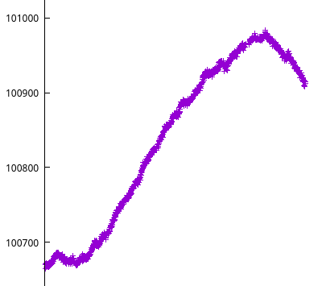

# wireless-weather-monitor

## description
A wireless weather monitoring system using an ESP32-based sensor node for data acquisition and a web server for data processing and storage.
The system is currently capable of logging and displaying pressure and temperature values.

## usage
**WARNING:** It is recommended not to connect the sensor node to the internet but rather to use a local network instead because there is currently
no support for SSL on the sensor node and therefore the HTTP traffic may expose sensitive information such as the server API key.

## hardware

## screenshots

### Web interface for downloading sensor data
  

### Example Excel file with sensor data
  

### Example plot of pressure data
Measurements were taken from approximately 6 PM until 1 AM.  
The graph was made using gnuplot.  
  
  
